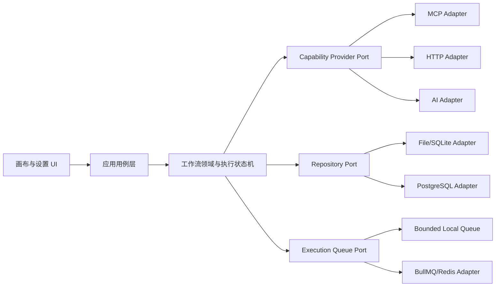

# Flux 工程架构深度审查与治理基线

日期：2026-07-29  
范围：桌面客户端、云端 API、工作流运行时、节点 SDK、持久化、调度器、MCP/HTTP 能力边界、构建与测试门禁。

## 1. 结论

Flux 的产品方向成立：画布是用户主界面，MCP、HTTP、AI 等外部能力应是底层连接设施，由用户在设置中定义连接，再由画布节点选择和调用。此前主要问题不在功能数量，而在部分关键链路缺少强约束：执行恢复会重复副作用、文件数据库可能静默丢数据、开发认证配置可能进入生产、队列和子进程缺少资源上限、局部 UI 热路径存在重复全量扫描。

本轮优先处理会造成数据错误、重复执行或生产安全失守的问题，并为尚未完成的架构演进增加边界测试。调整后的基线是：

1. 执行绑定不可变图快照，人工审批通过 checkpoint 恢复，不重新运行已完成节点。
2. 持久化读取失败必须显式失败或从备份恢复，写入采用临时文件、刷盘、备份和替换。
3. 生产配置 fail-closed；模拟认证默认关闭；JWT、CORS、数据库同步策略在启动时校验。
4. 内存执行队列有容量与并发上限；日志、节点状态、checkpoint 在终态前有序落盘。
5. MCP 仍按需启动，不因应用启动或读取设置而启动服务；本地进程采用环境白名单、输出上限、超时和持续 stderr 排空。
6. 画布保存采用单写者和会话代次，旧请求不能覆盖新工作流；渲染连接索引由 O(N×E) 降为 O(E)。
7. 本地调度扫描只做 claim 与派发，不再等待长任务完成；工作流清单单次读取，消除周期性 N+1 全库解析。

这些调整显著提高了当前版本的安全下限，但还不能把系统描述为“完全生产就绪”。统一能力网关、分布式取消、事务 outbox、默认 SQLite、网络 SSRF 防护和节点输出契约仍是进入大规模生产前的必要工作。

## 2. 目标架构与依赖方向



依赖只能由外向内：UI 可以调用应用用例；用例依赖端口；端口由组合根绑定具体适配器。领域包和工作流运行时不得直接访问 `fetch`、数据库、Zustand、Tauri、NestJS 或 BullMQ。现有两个内置 HTTP 节点仍是明确登记的历史债务，边界测试阻止债务继续扩散。

MCP 的产品边界如下：

- 设置页负责连接定义、JSON 导入/编辑、连接测试、工具发现和状态展示。
- 画布负责从已定义连接中选择工具，并保存稳定的连接引用与工具引用。
- 加载设置、打开画布和启动 Flux 都不启动 MCP 服务。
- STDIO 服务只在“测试/发现工具”或节点真实执行时按需启动；后续由连接管理器复用会话并在空闲超时后关闭。
- MCP 只是能力提供者之一，不在画布之上形成第二套工作流产品。

## 3. 风险与本轮处理

| 等级 | 领域 | 原始风险 | 本轮状态 |
| --- | --- | --- | --- |
| P0 | 执行一致性 | 人工审批后从头运行，可能重复扣款、写入或通知；云端还会读取被修改后的当前工作流 | 已改为不可变图快照、节点输出 checkpoint、单赢家审批状态转换和增量恢复，并增加本地/云端回归测试 |
| P0 | 数据安全 | 默认 JSON 文件库损坏后静默变成空库，下一次写入覆盖原数据 | 已改为 fail-closed、`.bak` 恢复、temp + fsync + replace；内存只在写盘成功后提交新快照 |
| P0 | 认证配置 | 模拟短信/微信通道默认启用；生产可能使用公开的 JWT 默认密钥 | 模拟通道改为非生产显式开启；生产强制随机且相互独立的密钥；开发缺省使用进程随机密钥并告警 |
| P1 | 队列健壮性 | 内存队列无界且 fire-and-forget；高负载可耗尽内存并产生未处理拒绝 | 增加容量、并发和配置范围限制；处理器异常收口；BullMQ 增加错误监听和关闭钩子 |
| P1 | 执行持久化 | 日志异步写入未等待，执行可能先进入终态 | 日志、节点状态和 checkpoint 进入同一有序持久化链，并在 finalize 前等待完成 |
| P1 | 本地调度 | 每 5 秒 N+1 读取全量本地库；长任务阻塞后续调度扫描 | 清单改为单快照读取；claim 与 RUNNING 一次持久化；扫描和任务执行解耦 |
| P1 | 画布数据 | 切换工作流后，旧自动保存响应可能把 B 图写入 A 会话 | 引入单写者保存协调器、合并待保存请求、发布优先级和会话代次失效 |
| P1 | MCP/HTTP 资源 | STDIO 行、stderr、继承环境和 HTTP chunked 响应缺少可靠边界 | 增加 1MB 消息/响应上限、8KB stderr 展示上限、持续 drain、子进程环境白名单、请求超时和流式限长 |
| P1 | 云端兼容性 | 本地 MCP/自定义节点可发布到云端，直到 worker 才报未注册 | 发布与启动前按云端注册表预检，不兼容节点在执行前返回结构化错误 |
| P1 | 数据库交付 | PostgreSQL 默认关闭 synchronize，但仓库没有迁移链 | 增加显式初始迁移、show/run/revert 脚本；生产继续禁止 synchronize |
| P2 | 客户端网络 | API 请求无默认超时，执行轮询可无限进行且固定频率 | 增加请求超时、轮询总截止时间和退避 |
| P2 | 画布性能 | 每个节点反复扫描全部边，复杂画布渲染为 O(N×E) | 增加单次 O(E) 连接索引；节点和分组查找使用 Map；画布首次访问时再加载 |
| P2 | 架构漂移 | core/application 可反向依赖 Store 或具体适配器；API 控制器边界无门禁 | 扩大静态架构合同，覆盖桌面 core/application、API controller/service、database adapter 和领域网络全局对象 |

## 4. 执行状态机与恢复语义

执行恢复必须满足以下不变量：

- `executionId` 从创建起绑定一个不可变的、已注入运行输入的图快照。
- checkpoint 保存已完成节点结果、输出端口值和当前人工暂停节点。
- 恢复时只跳过 checkpoint 中已完成的节点；所有尚未完成的并行分支仍应继续。
- 审批只允许 `PAUSED -> RUNNING` 的 compare-and-set 单赢家转换；重复提交得到冲突响应。
- 审批决定作为本次执行的临时 overlay，不回写不可变图快照，也不读取工作流当前版本。
- 终态写入必须发生在日志、节点状态和最终 checkpoint 持久化之后。

当前仍缺少跨进程事务 outbox 与节点级幂等键。因此，外部副作用节点在“调用成功但进程在 checkpoint 落盘前崩溃”的极窄窗口仍可能重复。进入支付、订单、消息群发等强副作用场景前，必须为节点声明 `effect`、`retryPolicy` 和稳定 `idempotencyKey`，并用 execution event/outbox 原子提交状态。

## 5. 性能与容量判断

已处理的确定性热点：

- 画布连接态由每节点扫描全部边改为一次边索引。
- 分组布局不再为每个分组反复遍历全部节点。
- 拓扑编译不再使用数组 `shift()` 形成 O(N²) 队列移动。
- 本地节点运行态更新使用 execution 内索引，不再在每次回调中用 `indexOf` 比较器重排完整列表。
- 调度器不再周期性对每个工作流重新读取并解析完整本地快照。
- 画布及其 `@xyflow/react` 依赖改为首次进入画布时加载，降低工作台首屏负担。
- 内存执行队列具备 backpressure，不再允许无限堆积。

尚需以基准测试驱动的热点：

- 拖拽期间的全图签名 `JSON.stringify` 与最多 80 份深拷贝历史，在大图上仍会造成主线程抖动。
- 本地工作空间和 API 文件库仍是整份 JSON 快照写入，数据量增长后会阻塞并放大写入。
- DAG 执行仍为串行；独立网络分支不能并行，吞吐受最长链之外的节点总时长影响。
- MCP 每次调用仍建立新进程/会话，冷启动和 stateful 工具体验不理想。
- 关键 UI 组合件仍过大，渲染依赖面和变更冲突成本偏高。

后续性能验收应固定三组样本（100/500/2000 节点），记录首屏 JS、画布首次进入时间、拖拽 P95 帧耗时、保存 P95、调度扫描时间、执行吞吐和峰值内存。没有基准数据时不做大范围 memo 化或并发重写。

## 6. 健壮性与安全边界

本轮确立的失败策略：

- 配置错误在启动阶段失败，不在请求阶段静默降级。
- 存储损坏显式报错或读取备份，不将损坏解释为空数据。
- 队列满返回可识别的服务不可用错误，不无限缓存。
- 网络、MCP 行、stderr、参数、工具目录和存储键都有明确上限或白名单。
- 自动保存的过期结果不能更新当前会话状态。
- 动态节点的部署位置在发布/启动前校验，不把兼容性错误推迟到 worker。

仍需完成的安全工作：

1. 云端 AI/HTTP 出站请求需要 DNS 解析固定、私网/metadata 地址拒绝、重定向复核和流式响应上限，防止 SSRF 与 DNS rebinding。
2. 桌面令牌和连接密钥应进入系统 keyring/Stronghold；普通 JSON 文件只保存非敏感元数据。
3. 登录、验证码、连接测试和执行创建需要按账号/IP/租户做分布式限流。
4. 自定义代码节点需要显式权限清单、CPU/内存/时间配额和真正隔离的 worker/进程沙箱。
5. 分布式取消/暂停状态需要进入持久化控制面并通过 Redis 广播，不能只依赖单进程 Map。

## 7. 扩展性约束

新增节点或连接类型必须满足：

- manifest 与 executor 分离；图中保存稳定类型、定义版本、placement 和 capability requirement。
- 所有外部 I/O 经 `CapabilityProviderRegistry`，领域/运行时不能直接使用网络全局对象。
- 发布前编译检查节点注册、版本、端口、配置、部署位置和连接绑定。
- 执行后校验输出端口、可序列化性、大小和可选 output schema。
- provider 自带超时、取消、并发舱壁、审计字段和错误映射。
- 本地与云端适配器运行同一套 repository/provider contract suite。

当前图 Schema 尚未持久化节点定义版本，`edge.condition` 也没有运行时语义。这两个字段在实现前不能被产品界面表达为已支持能力；下一次 Schema 升级应加入 definition version/lockfile，并选择“正式实现条件路由”或“迁移并移除 condition”。

## 8. 分阶段路线图

### 下一阶段：生产一致性

1. 建立 append-only execution event + transactional outbox，给副作用节点增加幂等键。
2. 将默认 API 文件库替换为 SQLite；保留 JSON 作为导入导出格式。
3. 将 HTTP/AI/MCP/自定义节点全部迁移到 Capability Provider Registry，清零领域包直接 `fetch` 允许名单。
4. 实现持久化分布式取消与 worker 心跳/租约。
5. 完成 SSRF、速率限制、密钥安全存储和资源预算。

### 随后：规模化与插件生态

1. 增加节点定义版本、迁移器、placement/capability lockfile。
2. 采用 ready-set DAG 调度，并按能力类型设置独立并发舱壁。
3. 建立 MCP connection manager：懒启动、会话复用、空闲 TTL 和退出清理。
4. 将画布历史改为结构化增量/patch，避免每次深拷贝全图。
5. 按 session、execution、selection、node presentation 和 shell actions 拆分巨型 UI 模块。

## 9. 验证门禁

合并前至少执行：

```text
pnpm --filter @flux/workflow-runtime test:unit
pnpm --filter @flux/api typecheck
pnpm --filter @flux/api build
pnpm --filter @flux/desktop typecheck
pnpm --filter @flux/desktop test:unit
pnpm --filter @flux/desktop build
node test/architecture-boundaries.contract.mjs
cargo test --manifest-path apps/desktop/src-tauri/Cargo.toml
```

数据库迁移还需在全新 PostgreSQL 与已有 synchronize 数据库各跑一次 `migration:run`；分布式取消、outbox、SSRF 与 keyring 未完成前，不应把相关场景标记为生产级支持。

## 10. 本轮实际验证结果

- 工作流运行时：3/3 通过，覆盖 fan-out、many input、审批恢复不重放上游及未完成并行分支继续。
- 桌面行为测试：75/75 通过；本地不可变快照恢复与重复审批单赢家：2/2 通过。
- API 核心门禁：构建通过；DTO、认证、队列、云端审批恢复、文件数据库恢复、发布/启动预检与执行服务 smoke 全部通过；12/12 个真实节点业务场景通过。
- Tauri/Rust：4/4 通过，覆盖 MCP STDIO 发现、调用、超大消息拒绝和既有点号存储键兼容。
- 架构边界合同：通过。
- `git diff --check`：通过，仅报告仓库既有的 Windows CRLF 转换提示。
- 桌面生产构建：通过，462 个模块；主 chunk 从审计基线约 969.8KB 降至 648.7KB（约 -33.1%），gzip 205.0KB；画布 68.3KB、共享查看器 5.5KB、图引擎公共 chunk 229.5KB 均按需加载；正式产物不再包含 source map。

本轮未运行真实 PostgreSQL 迁移集成和完整 Playwright E2E。迁移代码已通过 TypeScript 构建；发布前仍需在“空库”和“历史 synchronize 库”各执行一次迁移演练。主 chunk 仍高于计划中的 600KB/200KB gzip 预算，下一步应拆分节点 manifest 与 executor，而不是继续做零散组件懒加载。
