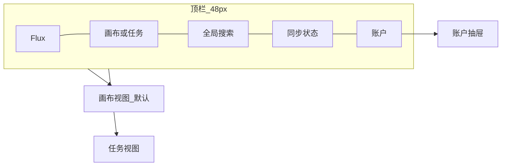
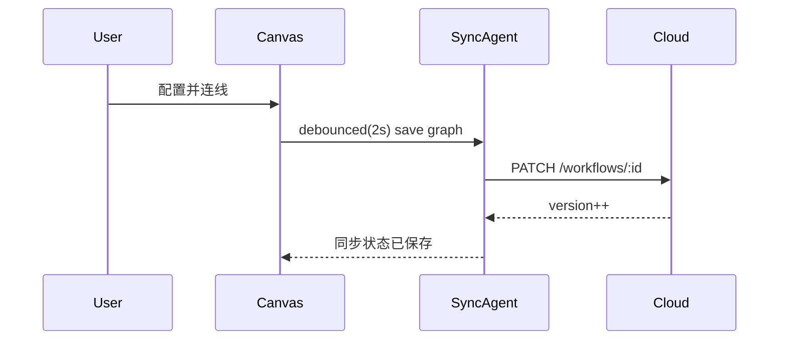

# Flux 无界工作流 — 产品需求文档（PRD）

> 版本：v1.0（首期 MVP）
> 状态：草案
> 最后更新：2026-06-15
> 关联文档：`flux_无界工作流_e45448d5.plan.md`（总体方案）

---

## 0. 文档说明

| 项 | 内容 |
|----|------|
| 文档目的 | 定义 Flux 桌面端首期产品的范围、用户、功能、交互、非功能需求与验收标准，作为研发、设计、测试的唯一事实来源（SSOT） |
| 适用读者 | 产品、设计、前端、后端、测试、运营 |
| 不在本文范围 | 详细 UI 视觉稿（见 UI 规范）、API 字段级定义（见 OpenAPI）、节点 SDK 接口细节（见 SDK 指南） |
| 术语约定 | 见「附录 A — 术语表」 |

---

## 1. 产品概述

### 1.1 一句话定义

**Flux** —— 极简界面承载无限业务，万能节点打通全场景办公生态的桌面端无界工作流平台。

### 1.2 产品定位

| 维度 | 定义 |
|------|------|
| 产品名 | Flux（工作流如流体，无界流动） |
| 形态 | Windows 桌面客户端 + 官方 SaaS 云端 |
| 目标平台（首期） | Windows 10/11 x64 |
| 商业模式 | **首期完全免费 / 开源使用**，积累一定用户基础后再引入收费（AI 权益 / 存储等增值项） |
| 核心差异 | 非固定模板 DAG 工具；**创作层（画布）与执行层（任务）严格分离**；节点可完全自定义、可分享、可二次迭代；**万能节点可操控用户授权范围内的任意应用** |

### 1.3 五大核心特质（产品北极星）

1. **无界画布** —— 唯一创作入口，无限平移缩放，承载复杂编排
2. **万能节点** —— 可承载万物的统一容器（应用 / 代码 / AI 模型 / 数据…），平台只做"接入·鉴权·调用·回传"底座
3. **任务分层** —— 执行与创作严格隔离，任务页不可编辑流程
4. **云端网络化** —— 多端同步，官方 SaaS
5. **可分享生态** —— 工作流/节点可发布、Fork、二次编辑

### 1.4 设计哲学

- **一屏一事**：默认全屏画布；任务/资产以右侧窄抽屉或底部执行条出现，禁止多层模态弹窗
- **少即是多**：主界面常驻元素 ≤ 5 类（顶栏、画布、右抽屉、底栏状态、浮动工具条）
- **创作执行分离**：编辑只在画布，执行只在任务，物理上不可越界

---

## 2. 目标用户与场景

### 2.1 目标用户画像

| 角色 | 描述 | 核心诉求 |
|------|------|----------|
| **自动化爱好者 / 效率极客** | 个人用户，想串联日常工具实现自动化 | 低门槛搭建、丰富节点、可分享复用 |
| **业务运营 / 增长** | 非技术但懂业务，需要重复任务自动化 | 可视化编排、模板 Fork、稳定执行 |
| **开发者 / 技术团队** | 需要自定义逻辑、对接内部系统 | 自定义节点 SDK、脚本沙箱、API 集成 |
> 注：首期聚焦个人用户，**团队管理者角色暂不作为目标用户**（团队协作非近期需求）。

### 2.2 核心使用场景

1. **个人自动化**：定时抓取数据 → AI 总结 → 推送到自己授权的应用（如飞书/邮件）
2. **操控自有应用**：用户把自己授权的应用接入节点 → 工作流自动操作该应用
3. **跨应用联动**：表单提交（Webhook）→ 写入用户授权的数据库 → 通知
4. **AI 工作流**：批量内容 → AI 生成/分析/决策（优先开源模型）→ 分发
5. **生态分享**：作者发布到市场 → 他人 Fork → 二次编辑后独立运行

### 2.3 用户旅程（典型新用户）


---

## 3. 范围定义（MVP 边界）

### 3.1 首期必做（MUST）

- 账户：多渠道注册/登录（微信 / 手机号 / 邮箱）+ Token 刷新
- 无界画布：无限视口、节点拖拽、连线、自动保存
- 5 个内置节点：手动触发、HTTP 请求、延时、条件分支、日志输出
- 工作流 CRUD + 发布
- 执行引擎：DAG 拓扑执行 + 任务队列
- 任务管理：启动 / 暂停 / 终止 / 日志 / 状态 / 收藏
- Windows 安装包（NSIS）+ 自动更新
- **首期完全免费 / 开源使用**（不含任何付费墙）

### 3.2 二期规划（SHOULD / 后置）

- 万能节点 SDK + 用户自定义节点上传
- **通用应用接入机制**：用户自助接入并操控授权范围内的任意应用（API/OAuth/Webhook）
- 已授权应用管理与撤销
- SQLite 离线同步 + 冲突解决
- 工作流发布 / Fork / 分享市场
- AI Proxy + 内置 AI 节点族（**优先开源模型**）+ 用量仪表盘
- 实时协作（多人光标、节点锁）

### 3.3 明确不做（WON'T，首期）

- 移动端 / macOS / Linux 客户端
- **团队协作 / 多人工作空间 / 角色权限**（非近期需求）
- 任何收费功能 / 付费墙（待用户基础成熟后再引入）
- **平台预置的固定第三方集成连接器**（改由用户自助接入任意应用）
- 私有化部署（仅预留 `storageRegion` 字段）
- 桌面端本地执行用户脚本（脚本仅云端沙箱）
- 市场评分 / 评论体系

---

## 4. 功能需求详述

### 4.1 模块总览

| 模块 | 层 | 首期状态 |
|------|----|---------|
| 账户与资产 | 资产层 | 部分（账户必做，资产二期） |
| 无界画布 | 创作层 | 必做 |
| 万能节点 | 创作层 | 内置节点必做，SDK 二期 |
| 任务管理 | 执行层 | 必做 |

---

### 4.2 账户与认证（FR-ACCOUNT）

| 编号 | 需求 | 优先级 | 验收要点 |
|------|------|--------|----------|
| FR-ACC-01 | 多渠道注册/登录：**微信、手机号、邮箱** | P0 | 微信 OAuth 扫码；手机号短信验证码；邮箱+密码；账号可绑定多渠道 |
| FR-ACC-02 | 登录获取 access + refresh token | P0 | access 短时效，refresh 安全存储 |
| FR-ACC-03 | Token 自动刷新 | P0 | 过期前静默刷新，失败跳登录 |
| FR-ACC-04 | 退出登录 / 强制下线 | P1 | 清除本地凭证 |
| FR-ACC-05 | 2FA（TOTP） | P2（二期） | 绑定/校验 |

> **团队协作（Workspace / 多人角色）首期不做**，亦非近期优先项。数据层保留 `workspaceId`（默认个人空间）以便未来扩展，但首期 UI 与权限模型只服务单用户。

**安全约束**：桌面端 refresh token 存于系统 Secure Storage；`Authorization: Bearer <access_token>`。

---

### 4.3 无界画布（FR-CANVAS）— 创作层唯一入口

| 编号 | 需求 | 优先级 | 验收要点 |
|------|------|--------|----------|
| FR-CVS-01 | 无限平移视口 | P0 | 空格拖拽 / 滚轮平移 |
| FR-CVS-02 | 缩放 10%–400% | P0 | 滚轮缩放、缩放比例显示 |
| FR-CVS-03 | 节点拖拽创建 | P0 | 从工具条/搜索拖入 |
| FR-CVS-04 | 双击空白快速插入（Command Palette） | P0 | 单行搜索、回车插入 |
| FR-CVS-05 | 节点多选 / 框选 / 删除 | P0 | 批量移动删除 |
| FR-CVS-06 | 端口连线（输出→输入） | P0 | 贝塞尔曲线，悬停删除 |
| FR-CVS-07 | 条件边（if/else 表达式） | P1 | 边上配置条件标签 |
| FR-CVS-08 | 节点配置右抽屉（320px） | P0 | 非居中弹窗，push 模式 |
| FR-CVS-09 | 自动保存（debounce 2s）+ 版本快照 | P0 | 保存状态可见 |
| FR-CVS-10 | 对齐参考线 / 分组节点 | P2 | 拖拽吸附 |
| FR-CVS-11 | 触发器节点（Cron/Webhook/手动/文件监听） | P1 | 画布内配置 |
| FR-CVS-12 | 迷你地图 + 缩放控件（左下，可折叠） | P1 | 缩略导航 |
| FR-CVS-13 | 实时协作（光标 + 节点锁） | P2（二期） | 服务端版本为准 |

**数据模型（序列化 JSON，见 `packages/workflow-schema`）**

```typescript
interface WorkflowGraph {
  id: string;
  version: number;
  viewport: { x: number; y: number; zoom: number };
  nodes: CanvasNode[];
  edges: CanvasEdge[];
  meta: { title: string; tags: string[] };
}

interface CanvasNode {
  id: string;
  type: string;                  // 对应 node-sdk 注册类型
  position: { x: number; y: number };
  data: Record<string, unknown>; // 节点私有配置
  ports: { inputs: Port[]; outputs: Port[] };
}

interface CanvasEdge {
  id: string;
  source: string;
  target: string;
  condition?: string;            // 可选条件表达式
}
```

---

### 4.4 万能节点系统（FR-NODE）— 核心壁垒

#### 4.4.1 核心理念：万能节点 = 可承载万物的统一容器

> **见名知义——"万能节点"就是可以承载万物的节点。**
> 一个节点对外只暴露统一的「输入端口 → 处理 → 输出端口」契约；**内部承载什么，由用户决定**。它可以装下应用、代码、AI 模型、数据……乃至未来任何可被"调用并回传结果"的对象。
>
> 平台只做一件事：把 **「安全接入 / 鉴权 / 调用 / 回传」** 这套**底座**做扎实，让任何"载体"都能以一致的方式被编排进工作流。平台**不穷举**具体的应用或能力，而是提供可承载万物的通用机制。

**统一抽象**：所有节点 = `载体（Carrier）` + `统一 IO 契约（ports/data）`。无论载体是应用、代码还是模型，对画布与执行引擎而言行为一致。

#### 4.4.2 节点可承载的载体类型（开放、可扩展）

| 载体类型 | 说明 | 平台底座职责 |
|----------|------|--------------|
| **授权应用** | 用户把自己有权使用的任意应用接入节点，由工作流操控（飞书、Notion、GitHub、内部系统、本地软件…无白名单） | 安全接入 / OAuth·API 鉴权 / 调用 / 回传 |
| **用户代码逻辑** | 用户编写的自定义代码（JS/表达式/脚本），实现任意业务逻辑 | 沙箱运行 / 输入注入 / 结果回传 |
| **AI 大模型** | 接入开源/商业大模型，做生成、分析、决策、Agent 等 | 模型路由（开源优先）/ 调用 / 用量回传 |
| **数据 / 文件** | 文件、数据库、对象存储等数据对象的读写 | 连接鉴权 / 读写 / 回传 |
| **子工作流** | 把另一条工作流作为一个节点嵌入（流程复用） | 子图调度 / IO 映射 |
| **触发器 / 事件** | Cron / Webhook / 文件监听等事件源 | 事件接入 / 入流 |
| **（未来）任意对象** | 只要能"调用并回传结果"，皆可被封装为载体 | 同一套接入/鉴权/调用/回传底座 |

> 关键点：**载体类型是开放集合**，平台通过统一底座支持新载体接入，而非逐一硬编码。这正是"万能"的来源——节点能力上限 = 用户能接入的一切。

#### 4.4.3 平台底座四要素（万能的支撑）

| 要素 | 职责 |
|------|------|
| **接入（Connect）** | 统一描述任意载体如何被纳入：API/OAuth/Webhook/代码/模型端点/浏览器自动化等 |
| **鉴权（Auth）** | 凭证服务端加密托管，操控边界 = 用户授权边界，可审计可撤销 |
| **调用（Invoke）** | 统一调用协议 `ctx.invoke(carrier, action, payload)`，屏蔽载体差异 |
| **回传（Return）** | 统一输出结构（NodeOutput），结果可流向下游任意节点 |

#### 4.4.4 功能需求

| 编号 | 需求 | 优先级 | 验收要点 |
|------|------|--------|----------|
| FR-NODE-01 | 内置节点：手动触发 | P0 | 工作流入口 |
| FR-NODE-02 | 内置节点：HTTP 请求 | P0 | 方法/URL/Header/Body 配置 |
| FR-NODE-03 | 内置节点：延时 | P0 | 毫秒/秒配置 |
| FR-NODE-04 | 内置节点：条件分支 | P0 | 表达式判定，多出口 |
| FR-NODE-05 | 内置节点：日志输出 | P0 | 写执行日志 |
| FR-NODE-06 | JSON Schema 配置表单自动生成 | P0 | 由 configSchema 渲染表单 |
| FR-NODE-07 | NodeShell 统一外框（标题/状态/端口/载体标识） | P0 | compact/card/mini 形态 |
| FR-NODE-08 | node-sdk 第三方节点注册 | P2（二期） | 脚手架 + 文档 |
| FR-NODE-09 | **代码载体**：用户自定义代码节点（沙箱运行） | P2（二期） | isolated-vm，仅云端执行 |
| FR-NODE-10 | **应用载体**：用户接入并操控授权范围内的任意应用 | P2（二期） | 支持 API Key/OAuth2/Webhook；凭证服务端加密 |
| FR-NODE-11 | **应用/载体授权管理**：账户内统一管理已接入对象、随时撤销 | P2（二期） | 撤销后相关节点失效并提示 |
| FR-NODE-12 | **AI 模型载体**：接入大模型做生成/分析/决策（开源优先） | P2（二期） | 走 AI Proxy，统一回传 |
| FR-NODE-13 | **数据/文件载体**：数据库/对象存储/文件读写 | P2（二期） | 连接鉴权 + 读写 |
| FR-NODE-14 | **子工作流载体**：嵌入另一条工作流作为节点 | P3 | IO 映射、防循环引用 |
| FR-NODE-15 | 浏览器/自动化操控（无 API 应用） | P3（探索） | 仅在用户授权范围内执行 |

**节点定义接口（node-sdk）**

```typescript
type CarrierKind = 'app' | 'code' | 'ai' | 'data' | 'subflow' | 'trigger' | string; // 开放扩展

interface NodeDefinition {
  id: string;            // 全局唯一 type
  name: string;
  category: string;
  icon: string;
  version: string;
  carrier: CarrierKind;                            // 该节点承载的载体类型
  ports: PortSchema;
  configSchema: JSONSchema;                        // 表单自动生成
  // 统一执行：底座据 carrier 完成接入/鉴权/调用/回传
  execute: (ctx: NodeContext) => Promise<NodeOutput>;
  bindings?: CarrierBindingRef[];                  // 引用用户授权的载体（应用凭证/模型端点/数据源…）
}
```

> 节点运行时通过统一协议 `ctx.invoke(bindingId, action, payload)` 调用所承载的载体（应用/模型/数据源等），由平台底座完成鉴权与回传，载体差异对工作流透明。

**节点来源**：① 系统内置（官方维护底座与基础载体节点）② 用户自定义（资产库，可分享）③ 市场 Fork（带版本与更新提示）。

> **安全红线**：节点对任意载体的操控严格受限于用户授权范围；凭证服务端加密存储；用户脚本仅云端沙箱执行；用户可在账户中随时查看与撤销授权。

---

### 4.5 任务管理（FR-TASK）— 纯执行层

**硬性约束**：任务视图**不提供**节点编辑、连线、触发器配置；仅只读展示流程缩略图（可选）。需要编辑必须显式「在画布中打开」跳转创作层。

| 编号 | 需求 | 优先级 | 验收要点 |
|------|------|--------|----------|
| FR-TASK-01 | 仅展示 `status=published` 工作流 | P0 | 草稿不出现 |
| FR-TASK-02 | 列表卡片（名称/状态/上次运行/收藏） | P0 | 状态徽章 |
| FR-TASK-03 | 一键启动 → executionId | P0 | POST /executions |
| FR-TASK-04 | 暂停（软）/ 终止（硬） | P0 | Redis cancel 信号 |
| FR-TASK-05 | 日志复盘（节点时间线 + stdout/stderr） | P0 | 虚拟滚动 |
| FR-TASK-06 | 状态机：空闲/运行中/成功/失败/已暂停 | P0 | 实时轮询/WS 更新 |
| FR-TASK-07 | 批量启动 / 批量取消 | P1 | 多选操作条 |
| FR-TASK-08 | 收藏（用户级 favorites） | P1 | 星标 |
| FR-TASK-09 | 行内操作图标-only（hover 显示文案） | P0 | 无「编辑流程」入口 |
| FR-TASK-10 | 分享复用：市场安装后出现在任务列表 | P2（二期） | 副本或引用 |

**执行引擎（云端）**：将 `WorkflowGraph` 编译为 DAG（拓扑排序 + 并行批次）；每节点一次 `execute`，输入为上游 outputs 聚合；状态机 `pending → running → success|failed|skipped`；BullMQ 调度 + 重试 + 并发控制。

---

### 4.6 资产、分享与同步（FR-ASSET，二期为主）

| 编号 | 需求 | 优先级 |
|------|------|--------|
| FR-AST-01 | 资产库（工作流/节点/模板）标签搜索 | P2 |
| FR-AST-02 | 版本历史 | P2 |
| FR-AST-03 | 可见性（私密/团队/公开）+ Fork 权限 | P2 |
| FR-AST-04 | `.flux` 导入导出（JSON + 资源 zip） | P2 |
| FR-AST-05 | SQLite 离线同步 + 冲突 UI（保留本地/使用云端） | P2 |
| FR-AST-06 | 分享市场（列表 + Fork） | P2 |
| FR-AST-07 | AI 权益仪表盘（额度/用量/超额） | P2 |

---

## 5. 非功能需求（NFR）

| 类别 | 需求 |
|------|------|
| **性能** | 单工作流 500+ 节点流畅平移缩放（≥ 50fps）；视口裁剪 + 节点虚拟化 |
| **同步时延** | 双设备同账号画布 5s 内同步 |
| **可用性** | 核心操作 ≤ 3 次点击；主界面无多级弹窗 |
| **离线** | 离线可继续编辑，恢复网络自动合并 |
| **安全** | Tauri 能力最小授权（capabilities）+ 受控 CSP，渲染层无系统访问；用户脚本仅云端沙箱；OAuth token 服务端加密存储 |
| **可靠性** | 任务执行失败可重试；冲突乐观锁（version）避免静默覆盖 |
| **可观测** | 执行日志、崩溃上报 |
| **数据隔离** | 资源带 `workspaceId`（首期=个人空间），PostgreSQL RLS 强制按用户隔离 |
| **应用授权安全** | 节点操控应用严格限于用户授权范围；凭证服务端加密；可随时撤销 |
| **AI 模型策略** | AI Proxy 优先路由开源模型，按可用性/成本回退 |
| **兼容** | Windows 10 1809+ / Windows 11 |

---

## 6. 信息架构与关键交互

### 6.1 信息架构



### 6.2 模式切换规则（强约束）

- 顶栏 `ModeSwitch` 在「画布 / 任务」间切换，路由严格隔离
- 任务视图无任何编辑控件；E2E 测试需拦截编辑 API 以验证隔离
- 账户为右侧抽屉，不占用主工作区

### 6.3 画布保存交互流



---

## 7. 数据与接口概要

### 7.1 核心数据表（PostgreSQL）

`users` · `user_identities`(微信/手机/邮箱多渠道绑定) · `workflows`(graph_json, version, status:draft|published) · `workflow_versions` · `executions` · `execution_logs` · `execution_node_runs` · `node_definitions` · `assets` · `asset_permissions` · `shares` · `market_items` · `forks` · `app_authorizations`(用户授权的应用) · `app_credentials`(加密凭证) · `ai_usage_logs`

> `workspaceId` 字段在各资源上保留（默认指向用户个人空间），为未来团队功能预留，**首期不建团队相关表**。收费相关表（`subscriptions` 等）待商业化阶段再引入。

### 7.2 核心 API 端点

| 领域 | 端点 |
|------|------|
| Auth | `POST /auth/wechat`（扫码） `POST /auth/sms`（手机验证码） `POST /auth/email` `POST /auth/refresh` |
| Workflows | `CRUD /workflows` `POST /workflows/:id/publish` |
| Executions | `POST /executions` `GET /executions/:id/logs` |
| Nodes | `GET /nodes/registry` `POST /nodes/custom` |
| Share | `POST /share` `GET /market` `POST /fork/:id` |
| Assets | `GET /assets` `POST /assets/export` `/import` |
| AI | `POST /ai/completions`（Proxy，优先路由开源模型） |
| Apps（用户自助接入） | `GET /apps/authorizations` `POST /apps/authorize` `DELETE /apps/authorizations/:id` `POST /apps/:id/invoke` |
| Realtime | `WS /collab/:workflowId` |

> 字段级定义见 OpenAPI 规范文档（待产出）。

---

## 8. 验收标准

| 特质 | 验收点 |
|------|--------|
| 无界画布 | 单工作流 500+ 节点流畅平移缩放；所有编排仅在此完成 |
| 万能节点 | 节点可承载多种载体（应用/代码/AI 模型/数据）并以统一 IO 编排；第三方可通过 SDK 注册节点（二期） |
| 任务分层 | 任务页无编辑控件；E2E 测试拦截编辑 API |
| 云端网络化 | 双设备登录同账号，画布 5s 内同步 |
| 可分享生态 | 公开工作流可被 Fork 并在画布二次编辑后独立执行（二期） |
| 极简 UI | 主界面无多级弹窗；核心操作 ≤ 3 次点击 |

---

## 9. 发布计划（与路线图对齐）

| 阶段 | 周期 | 交付 |
|------|------|------|
| Phase 1 基础骨架 | 4–6 周 | Monorepo、Tauri 壳、登录、画布 MVP、Workflow CRUD、5 内置节点 |
| Phase 2 执行与任务层 | 4 周 | DAG 引擎、BullMQ、任务 UI、路由隔离 |
| Phase 3 节点 SDK | 4 周 | node-sdk、表单自动渲染、自定义节点上传 |
| Phase 4 同步与分享 | 3 周 | SQLite 离线、发布/Fork、`.flux` 导入导出 |
| Phase 5 AI 与应用接入 | 4 周 | AI Proxy（开源模型优先）、AI 节点族、通用应用接入机制、授权管理 |
| Phase 6 协作与打磨 | 3 周 | 实时协作、性能优化、Windows 安装包 + 自动更新 |

**首期交付物**：可运行 Demo（画布 + 登录 + 1 条工作流执行闭环）+ Windows NSIS 安装包 + 产品/UI/技术文档。

---

## 10. 风险与对策

| 风险 | 对策 |
|------|------|
| 画布性能 | 视口裁剪渲染、节点虚拟化、Web Worker 布局计算 |
| 万能节点安全 | 用户脚本仅云端沙箱执行；桌面只编辑配置 |
| 应用越权风险 | 操控严格限于用户授权范围；凭证服务端加密；授权可审计、可随时撤销 |
| 应用接入碎片化 | 提供通用机制（API/OAuth/Webhook）而非穷举连接器；以模板降低用户接入成本 |
| 同步冲突 | 乐观锁 version + 明确冲突 UI，避免静默覆盖 |
| 范围膨胀 | 严格执行分期；首期只做通用扩展口，不做平台预置集成 |

---

## 附录 A — 术语表

| 术语 | 含义 |
|------|------|
| 无界画布 | 无限平移缩放的唯一创作视图 |
| 万能节点 | 可承载万物的统一容器：内部可装应用/代码/AI 模型/数据等任意"载体"，对外统一 IO |
| 载体（Carrier） | 节点内部承载的对象类型（app/code/ai/data/subflow/trigger… 开放可扩展） |
| 平台底座 | 万能节点的支撑能力：接入 / 鉴权 / 调用 / 回传 四要素 |
| 应用授权 | 用户向 Flux 授予对某应用的操作权限（OAuth/API Key 等），节点据此操控 |
| 创作层 / 执行层 | 画布（编辑）/ 任务（运行），物理隔离 |
| WorkflowGraph | 工作流序列化数据结构 |
| DAG | 有向无环图，执行计划编译目标 |
| Fork | 复制他人工作流/节点以二次编辑 |
| `.flux` | Flux 工作流导出包（JSON + 资源 zip） |
| RLS | PostgreSQL 行级安全，按用户隔离数据 |

## 附录 B — 优先级定义

| 标记 | 含义 |
|------|------|
| P0 | 首期必做，阻塞发布 |
| P1 | 首期应做，可微调 |
| P2 | 二期及以后 |
| P3 | 探索性，时机成熟再评估 |

## 附录 C — 已决策记录（Resolved Decisions）

| # | 问题 | 决策（2026-06-15） |
|---|------|--------------------|
| 1 | 注册方式 | **微信、手机号、邮箱**多渠道注册/登录，账号可绑定多渠道 |
| 2 | AI 模型优先级 | **优先开源模型**，AI Proxy 按可用性/成本回退 |
| 3 | 应用集成定位 | **不预置固定第三方连接器**；万能节点提供通用接入机制，由用户自助把授权范围内的任意应用接入节点并操控 |
| 4 | 商业化 | **首期完全免费 / 开源使用**，积累用户基础后再引入收费 |
| 5 | 团队协作 | **首期不做**，亦非近期优先项；数据层保留 `workspaceId` 以便未来扩展 |

## 附录 D — 新增待决问题（Open Questions）

1. 微信登录首期采用开放平台扫码（PC）还是公众号/小程序授权？是否需要 App 备案资质？
2. 开源模型的部署形态：自建推理服务（如 vLLM + Qwen/Llama 系列）还是接入第三方开源模型 API？
3. "通用应用接入"中，浏览器/自动化操控（FR-NODE-13）涉及更高安全风险，是否纳入二期还是延后探索？
4. 既然首期免费且无团队，分享市场（Fork）是否仍保留在二期，还是可适当前移以促进生态？
