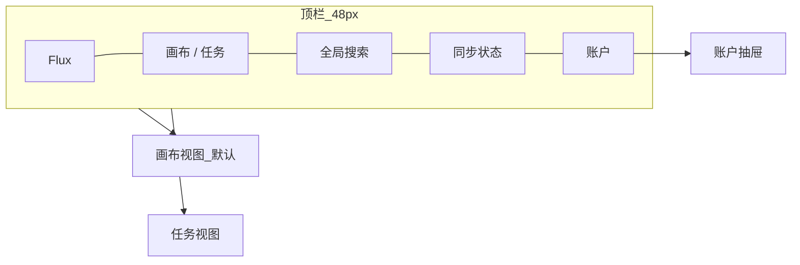

# Flux 无界工作流 — UI 设计规范

> 版本：v1.0（首期 MVP）
> 状态：草案
> 最后更新：2026-06-15
> 关联文档：`docs/prd.md`、`flux_无界工作流_e45448d5.plan.md`
> 落地位置：设计令牌 → `packages/ui/src/tokens`；组件 → `packages/ui/src/components`

---

## 0. 文档说明

本规范定义 Flux 桌面端的视觉语言、设计令牌、组件库与交互模式，作为设计与前端实现的唯一事实来源。所有数值以**设计令牌（CSS Variables）**承载，组件**禁止硬编码**颜色/间距/圆角，必须引用令牌。

---

## 1. 设计原则

| 原则 | 含义 | 落地约束 |
|------|------|----------|
| **一屏一事** | 默认全屏画布；辅助信息走右抽屉/底栏 | 禁止多层模态弹窗（最多 1 层确认弹窗） |
| **少即是多** | 主界面常驻元素 ≤ 5 类 | 顶栏 / 画布 / 右抽屉 / 底栏 / 浮动工具条 |
| **创作执行分离** | 编辑只在画布，执行只在任务 | 任务视图无任何编辑控件 |
| **图标优先** | 主操作以图标承载，hover 出文案 | 关键操作 ≤ 3 次点击可达 |
| **低饱和护眼** | 深色低饱和为默认主题 | 单一强调色，克制使用 |
| **载体可辨识** | 万能节点按载体类型有统一视觉标识 | 每种 Carrier 一个图标 + 色条 |

---

## 2. 设计令牌（Design Tokens）

### 2.1 颜色 — 语义令牌

> 深色为默认主题。所有颜色以语义命名，组件只引用语义令牌，不直接用色值。

```css
/* 背景层级 */
--bg-base:      #0f1114;   /* 应用底色，护眼深灰 */
--bg-surface:   #1a1d23;   /* 面板/卡片 */
--bg-elevated:  #21252d;   /* 抽屉/浮层/弹层 */
--bg-inset:     #0b0d10;   /* 输入框/凹陷区 */

/* 边框/分隔 */
--border-subtle:  #2a2f38; /* 默认分隔线 */
--border-strong:  #3a4150; /* 强调边框/选中 */

/* 文本 */
--text-primary:  #e8eaed;
--text-muted:    #8b929a;
--text-disabled: #565d66;
--text-inverse:  #0f1114;

/* 强调色（单一，低饱和蓝） */
--accent:        #5b8def;
--accent-hover:  #6f9bf2;
--accent-active: #4a79d6;
--accent-subtle: rgba(91, 141, 239, 0.12); /* 选中底色 */

/* 状态色 */
--success: #4caf82;
--warning: #d4a053;
--danger:  #c75c5c;
--info:    #5b8def;

/* 状态-柔和底（徽章/提示背景） */
--success-subtle: rgba(76, 175, 130, 0.14);
--warning-subtle: rgba(212, 160, 83, 0.14);
--danger-subtle:  rgba(199, 92, 92, 0.14);

/* 画布 */
--canvas-bg:    #0f1114;
--canvas-dot:   rgba(42, 47, 56, 0.5); /* 点阵网格，15% 视觉透明度 */
--canvas-edge:  #5b8def;               /* 连线默认 */
--canvas-edge-hover: #6f9bf2;
```

### 2.2 载体类型色（万能节点）

> 每种 Carrier 配一个语义色，用于节点左侧色条与图标，帮助一眼辨识节点承载什么。

```css
--carrier-app:     #5b8def;  /* 授权应用 — 蓝 */
--carrier-code:    #b48ead;  /* 用户代码 — 紫 */
--carrier-ai:      #4caf82;  /* AI 大模型 — 绿 */
--carrier-data:    #d4a053;  /* 数据/文件 — 琥珀 */
--carrier-subflow: #56b6c2;  /* 子工作流 — 青 */
--carrier-trigger: #c75c5c;  /* 触发器 — 红 */
--carrier-basic:   #8b929a;  /* 基础/内置 — 灰 */
```

### 2.3 字体

```css
--font-sans: "Inter", "HarmonyOS Sans SC", "Microsoft YaHei", system-ui, sans-serif;
--font-mono: "JetBrains Mono", "Cascadia Code", Consolas, monospace; /* 代码载体/日志 */

/* 字号阶梯（px / line-height） */
--text-xs:   11px;  /* 端口标签、徽章 */
--text-sm:   12px;  /* 辅助文字、表单说明 */
--text-base: 13px;  /* 正文默认（桌面密度） */
--text-md:   14px;  /* 节点标题、按钮 */
--text-lg:   16px;  /* 抽屉标题 */
--text-xl:   20px;  /* 空状态/引导标题 */

--leading-tight:  1.3;
--leading-normal: 1.5;

--weight-regular: 400;
--weight-medium:  500;
--weight-semibold: 600;
```

### 2.4 间距（4px 基准栅格）

```css
--space-0: 0;
--space-1: 4px;
--space-2: 8px;
--space-3: 12px;
--space-4: 16px;
--space-5: 20px;
--space-6: 24px;
--space-8: 32px;
--space-10: 40px;
```

### 2.5 圆角 / 阴影 / 层级

```css
/* 圆角 */
--radius-sm: 4px;   /* 徽章、输入框 */
--radius-md: 6px;   /* 按钮、节点 */
--radius-lg: 10px;  /* 卡片、抽屉 */
--radius-full: 9999px;

/* 阴影（克制，仅浮层用） */
--shadow-drawer: 0 8px 32px rgba(0, 0, 0, 0.4);
--shadow-popover: 0 4px 16px rgba(0, 0, 0, 0.35);
--shadow-node-selected: 0 0 0 2px var(--accent);

/* z-index 层级 */
--z-canvas: 0;
--z-floating-toolbar: 100;
--z-drawer: 200;
--z-topbar: 300;
--z-command-palette: 400;
--z-popover: 500;
--z-toast: 600;
--z-modal: 700;
```

### 2.6 动效

```css
--motion-fast:   120ms;  /* hover、按钮反馈 */
--motion-normal: 200ms;  /* 抽屉滑入、面板展开 */
--motion-slow:   320ms;  /* 视图切换 */
--ease-standard: cubic-bezier(0.4, 0, 0.2, 1);
--ease-out:      cubic-bezier(0, 0, 0.2, 1);
```

> 动效原则：克制、有意义、可被"减少动态效果"系统设置关闭。

---

## 3. 布局系统

### 3.1 全局栅格

```
┌────────────────────────────────────────────────────────┐
│  顶栏 TopBar (48px)                                       │  z:300
├────────────────────────────────────────────────────────┤
│                                          │               │
│                                          │   右抽屉       │
│         主工作区（画布 / 任务）           │   Drawer      │  z:200
│                                          │   320px       │
│  [浮动工具条]                            │  (push 模式)  │  z:100
│  [左下: 缩放+迷你地图]                    │               │
├────────────────────────────────────────────────────────┤
│  底栏 StatusBar (28px)：同步状态 / 执行进度 / 缩放比例    │
└────────────────────────────────────────────────────────┘
```

| 区域 | 尺寸 | 说明 |
|------|------|------|
| 顶栏 | 高 48px | Logo / 模式切换 / 全局搜索 / 同步状态 / 账户 |
| 主工作区 | 自适应 | 画布或任务，路由严格隔离 |
| 右抽屉 | 宽 320px | 节点配置 / 账户；push 模式（挤压而非遮挡画布） |
| 底栏 | 高 28px | 同步状态、执行进度、缩放比例 |
| 浮动工具条 | 浮于画布 | 节点 / 连线 / 缩放 / 对齐 |

### 3.2 抽屉行为

- **push 模式**（默认）：抽屉推开主工作区，不遮挡，画布可继续操作
- **overlay 模式**（窄屏 < 1280px）：半透明遮罩浮层
- 抽屉宽度固定 320px；标题区 48px + 内容滚动区 + 底部操作区（如需）

---

## 4. 信息架构与导航



**导航约束**
- `ModeSwitch` 是画布/任务的唯一切换点，二者路由隔离
- 任务视图无编辑入口；编辑需点「在画布中打开」跳转
- 账户为右抽屉，不占主工作区，不切换路由

---

## 5. 核心页面线框规范

### 5.1 无界画布（默认首页）

```
┌──────────────────────────────────────────────────────┐
│ Flux   [画布|任务]        🔍搜索        ⟳同步  👤      │ 顶栏
├──────────────────────────────────────────────────────┤
│  · · · · · · · · · · · · · · · · · ·                   │
│  · · ┌─────────┐        ┌─────────┐ · · ┌──────────┐  │
│  · · │▌手动触发 │──────▶│▌HTTP请求│────▶│ 配置抽屉  │  │
│  · · └─────────┘        └─────────┘ · · │ (320px)  │  │
│  · · · · · · · · · · · · · · · · · ·     │          │  │
│  ┌────────┐                              │          │  │
│  │缩放100% │  [迷你地图]                  └──────────┘  │
│  └────────┘                  [+节点][连线][对齐][缩放] │ 浮动条
├──────────────────────────────────────────────────────┤
│ ⟳ 已保存 · 12 节点 · 缩放 100%                          │ 底栏
└──────────────────────────────────────────────────────┘
```

**要点**
- 全视口无限点阵网格（`--canvas-dot`，约 15% 视觉透明度）
- 双击空白 → 弹出 **CommandPalette**（单行搜索插入节点）
- 选中节点 → 右侧 320px 配置抽屉（**非居中弹窗**）
- 连线：贝塞尔曲线；hover 显示删除/条件标签
- 左下：缩放比例 + 可折叠迷你地图
- 浮动工具条：右下角，图标-only

### 5.2 任务管理

```
┌──────────────────────────────────────────────────────┐
│ Flux   [画布|任务]        🔍搜索        ⟳同步  👤      │
├──────────────────────────────────────────────────────┤
│  ★ 每日数据汇总      ● 运行中   2分钟前   ▶ ⏸ ⏹ 📄     │
│  ☆ 周报生成         ✓ 成功     1小时前   ▶      📄     │
│  ☆ 表单同步         ✗ 失败     昨天      ▶      📄     │
│                                                        │
│  [批量操作条：▶启动选中  ⏹取消选中]（多选时出现）       │
├──────────────────────────────────────────────────────┤
│ 3 个工作流 · 1 运行中                                   │
└──────────────────────────────────────────────────────┘
```

**要点**
- 仅展示 `status=published` 工作流
- 行内操作图标-only（hover 出文案）：启动 ▶ / 暂停 ⏸ / 终止 ⏹ / 日志 📄
- **无「编辑流程」入口**；需编辑显式「在画布中打开」
- 点日志 → 右抽屉打开 `LogStream`（节点时间线 + stdout/stderr）
- 收藏星标置于行首

### 5.3 账户抽屉

```
┌──────────────┐
│ 👤 用户名     │  Tab: 个人 | 安全 | 已授权应用 | AI用量
│──────────────│
│ 个人信息      │
│ 绑定渠道      │  微信 ✓ / 手机 ✓ / 邮箱 ✓
│ 已授权应用    │  列表 + 撤销按钮
│ AI 用量       │  (二期)
└──────────────┘
```

**要点**
- 多渠道绑定状态（微信/手机/邮箱）
- **已授权应用/载体**：列表展示用户接入的对象，支持随时撤销（撤销后相关节点提示失效）
- 收费相关首期不展示

---

## 6. 组件库规范（`packages/ui`）

> 所有组件引用设计令牌；默认深色；支持键盘可达与 focus 可见。

### 6.1 组件清单

| 组件 | 用途 | 关键状态 |
|------|------|----------|
| `Surface` | 统一面板/卡片背景 | base / surface / elevated |
| `Drawer` | 右侧配置，push/overlay 模式 | open / closed |
| `IconButton` | 图标主操作，hover 出 tooltip | default / hover / active / disabled |
| `Button` | 文字按钮 | primary / ghost / danger |
| `Badge` | 状态徽章 | success / warning / danger / running / idle |
| `CommandPalette` | 节点/工作流快速检索 | 单行输入 + 结果列表 |
| `LogStream` | 任务日志虚拟滚动 | 自动滚底 / 暂停滚动 |
| `NodeShell` | 万能节点统一外框 | 见 §7 |
| `Tooltip` | hover 文案 | — |
| `Toast` | 轻量反馈（保存/错误） | success / error / info |
| `SchemaForm` | 由 JSON Schema 自动生成配置表单 | 见 §6.4 |
| `Tabs` | 抽屉内分页 | — |
| `Switch / Select / Input / Textarea` | 表单原子 | default / focus / error / disabled |

### 6.2 IconButton

- 尺寸：28×28（紧凑工具条）/ 32×32（默认）
- 默认仅图标；hover 200ms 后显示 `Tooltip`
- 状态：default → hover（`--bg-elevated`）→ active（`--accent-subtle` + `--accent` 图标）

### 6.3 Badge（任务状态映射）

| 状态 | 文案 | 色令牌 |
|------|------|--------|
| idle | 空闲 | `--text-muted` |
| running | 运行中 | `--info`（脉冲动画） |
| success | 成功 | `--success` |
| failed | 失败 | `--danger` |
| paused | 已暂停 | `--warning` |

### 6.4 SchemaForm（核心）

- 输入：节点 `configSchema`（JSON Schema）→ 自动渲染表单
- 类型映射：`string`→Input、`number`→数字输入、`boolean`→Switch、`enum`→Select、`object`→分组、`array`→可增删列表、`string(format:code)`→代码编辑器
- 校验：实时 + 失焦；错误用 `--danger` 文案
- 用于：节点配置抽屉、自定义节点配置

---

## 7. 万能节点视觉规范（NodeShell）

> 节点是画布的主角。NodeShell 是所有载体类型的统一外框，通过**左侧载体色条 + 载体图标**辨识承载内容。

### 7.1 结构

```
┌────────────────────────────┐
│▌ [icon] 节点标题      ● 状态 │  ← 标题栏（▌=载体色条）
│▌                            │
│▌  ◉ 输入端口   输出端口 ◉   │  ← 端口区
│▌  ◉ 输入2                   │
└────────────────────────────┘
```

- 左侧 3px **载体色条**：颜色取自 §2.2（app/code/ai/data/subflow/trigger/basic）
- 标题栏：载体图标 + 标题 + 右侧状态点
- 端口：输入在左、输出在右；圆点 `◉`，hover 放大并高亮
- 选中：`--shadow-node-selected`（2px accent 外环）

### 7.2 三种形态

| 形态 | 尺寸 | 场景 |
|------|------|------|
| `card`（默认） | 宽 200–280px | 常规编辑，显示标题+端口+摘要 |
| `compact` | 宽 160px | 密集图，仅标题+端口 |
| `mini` | 仅图标圆点 | 大规模缩略（缩放 < 40% 自动切换） |

### 7.3 状态视觉

| 节点运行态 | 视觉 |
|------------|------|
| 未运行 | 默认 |
| 运行中 | 标题状态点脉冲 `--info` + 顶部进度微条 |
| 成功 | 状态点 `--success` |
| 失败 | 状态点 `--danger` + 边框 `--danger` |
| 跳过 | 半透明 60% |

### 7.4 连线（Edge）

- 默认：贝塞尔曲线，`--canvas-edge`，1.5px
- hover：`--canvas-edge-hover` + 中点显示删除 ✕ / 条件标签
- 条件边：虚线 + 标签气泡（如 `if x>0`）
- 连接中：从端口拖出实时跟随，合法目标端口高亮

---

## 8. 交互模式

### 8.1 画布手势

| 操作 | 行为 |
|------|------|
| 滚轮 | 平移（垂直）/ Shift+滚轮（水平） |
| Ctrl/⌘ + 滚轮 | 缩放（光标为锚点，10%–400%） |
| 空格 + 拖拽 | 抓手平移 |
| 双击空白 | CommandPalette 插入节点 |
| 拖拽端口→端口 | 连线 |
| 框选 | 多选节点 |
| Delete | 删除选中 |
| Ctrl+Z / Ctrl+Shift+Z | 撤销 / 重做 |

### 8.2 快捷键

| 快捷键 | 功能 |
|--------|------|
| `Ctrl+K` | 全局命令面板 |
| `Ctrl+S` | 立即保存（默认已自动保存） |
| `Ctrl+F` | 画布内搜索节点 |
| `1` / `2` | 切换画布 / 任务 |
| `Esc` | 关闭抽屉/弹层 |

### 8.3 反馈与保存

- 自动保存（debounce 2s）；底栏显示 `保存中… / 已保存 / 离线待同步`
- 破坏性操作（删除多节点/撤销授权）→ 单层确认弹窗
- 网络异常 → Toast + 底栏标记，进入离线编辑

### 8.4 空状态与引导

- 空画布：居中提示「双击任意位置添加第一个节点」+ `Ctrl+K`
- 空任务：「在画布发布工作流后，可在此运行」

---

## 9. 无障碍与适配

| 项 | 要求 |
|----|------|
| 对比度 | 正文文本对背景 ≥ 4.5:1；大字 ≥ 3:1 |
| 焦点可见 | 所有可交互元素有 `:focus-visible` 环（`--accent`） |
| 键盘可达 | 顶栏、抽屉、表单、命令面板全键盘操作 |
| Tooltip | 不承载唯一关键信息（图标须有 aria-label） |
| 减少动效 | 尊重系统「减少动态效果」，关闭非必要动画 |
| 最小点击区 | ≥ 28×28px |
| 窗口适配 | ≥ 1024px 可用；< 1280px 抽屉转 overlay |

---

## 10. 主题与令牌交付

- 首期仅**深色主题**；令牌结构预留 `light` 以便后续扩展
- 令牌以 CSS Variables + TypeScript 常量双份导出（`packages/ui/src/tokens`）
- 组件**禁止**硬编码色值/间距，统一引用令牌
- 交付物：令牌文件 + Storybook（或静态组件展示页）覆盖 §6 全部组件

---

## 附录 A — 图标规范

- 线性图标，1.5px 描边，24×24 网格，导出 20px/16px 两档
- 载体图标语义：应用🔌 / 代码`</>` / AI✦ / 数据▤ / 子流程⤵ / 触发器⚡
- 统一图标库（如 Lucide）；自定义图标遵循同一描边风格

## 附录 B — 命名与令牌约定

- 颜色语义命名：`--<类别>-<层级/状态>`（如 `--bg-surface`、`--accent-hover`）
- 组件 props 状态词统一：`default / hover / active / disabled / focus / error`
- 间距/圆角只用令牌阶梯，不出现魔法数字

## 附录 C — 待决问题

1. 字体是否采购商用字体（如 Inter 免费，中文 HarmonyOS Sans 免费）或仅用系统字体？
2. 浅色主题是否纳入二期，还是长期只做深色？
3. 迷你地图在大规模图（500+ 节点）下的性能与默认折叠策略？
4. 节点 `mini` 形态的自动切换阈值（当前定 40% 缩放）是否合适？
