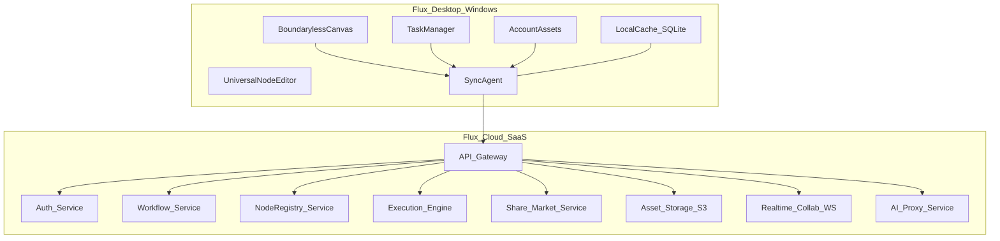
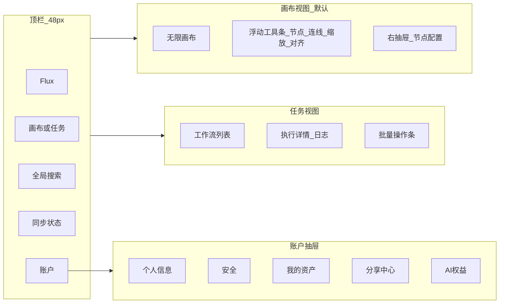
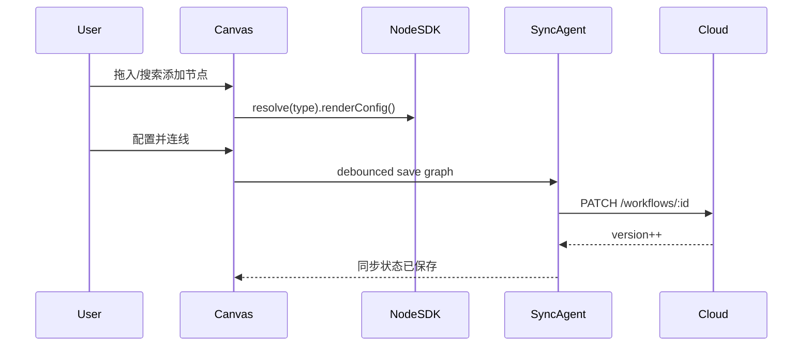
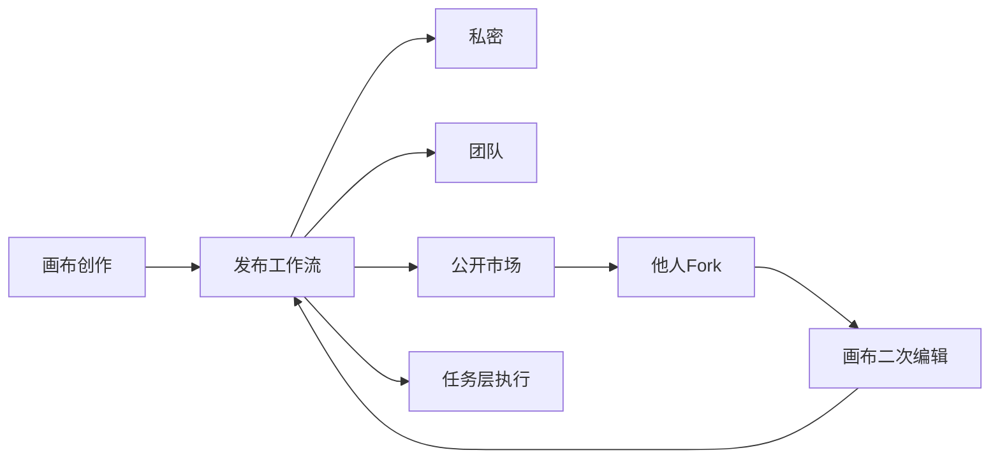

# Flux 无界工作流桌面端 — 全套产品与开发方案

## 一、产品命名与愿景

| 维度 | 定义 |
|------|------|
| 产品名 | **Flux**（工作流如流体，无界流动） |
| 形态 | Windows 桌面客户端 + 官方 SaaS 云端 |
| 一句话 | 极简界面承载无限业务，万能节点打通全场景办公生态 |
| 与竞品差异 | 非固定模板 DAG 工具；创作层（画布）与执行层（任务）严格分离；节点可完全自定义、可分享、可二次迭代 |

---

## 二、系统架构总览



**分层原则（必须贯彻）**

- **创作层**：仅 [`Canvas`](packages/desktop/src/features/canvas) — 流程设计、节点编排、配置、AI/联动编排
- **执行层**：仅 [`TaskManager`](packages/desktop/src/features/tasks) — 启动/暂停/终止/日志/收藏/批量，**禁止**节点编辑
- **资产层**：[`Account`](packages/desktop/src/features/account) — 身份、权限、私有/团队/公开资产、权益

---

## 三、技术选型（Windows 首期 + SaaS）

| 层级 | 选型 | 理由 |
|------|------|------|
| 桌面壳 | **Tauri 2（Rust + 系统 WebView2）** | 体积/内存远小于 Electron，Windows WebView2 同为 Chromium 内核保证画布渲染一致；Rust 侧更适合本地自动化能力 |
| 桌面 UI | **React 18 + TypeScript + Vite** | 组件化、生态丰富；前端与壳层解耦，可复用 |
| 画布引擎 | **@xyflow/react（React Flow v12）+ 自定义 InfiniteViewport** | 无限平移缩放、节点/边编排成熟；叠加自由标注层满足「无界」 |
| 样式 | **Tailwind CSS + CSS Variables 设计令牌** | 低饱和主题、极简一致性 |
| 状态 | **Zustand**（画布/UI）+ **TanStack Query**（云端数据） | 轻量、分层清晰 |
| 本地缓存 | **SQLite（better-sqlite3）** | 离线草稿、增量同步队列 |
| 后端 API | **NestJS + TypeScript** | 模块化、与前端同语言 |
| 数据库 | **PostgreSQL 16** | 工作流图、权限、审计 |
| 队列/调度 | **Redis + BullMQ** | 任务执行、重试、并发控制 |
| 对象存储 | **S3 兼容（阿里云 OSS / AWS S3）** | 工作流包、节点模板、导出备份 |
| 实时协作 | **Socket.io** | 画布多人光标、节点锁 |
| AI 接入 | **统一 AI Proxy**（OpenAI / 通义 / 自建模型路由） | 节点侧只调 Proxy，权益在账户层计费 |
| 桌面打包 | **Tauri bundler** | NSIS 安装包、内置签名自动更新（Tauri updater） |

**Monorepo 结构（推荐 pnpm workspace）**

```
Flux_ywm/
├── apps/
│   ├── desktop/          # Tauri 壳（src-tauri/）+ React/Vite 渲染进程
│   └── api/              # NestJS 云端 API
├── packages/
│   ├── canvas-core/      # 画布引擎、视口、序列化
│   ├── node-sdk/         # 万能节点定义 SDK（第三方扩展）
│   ├── workflow-schema/  # 工作流 JSON Schema、校验
│   ├── ui/               # 极简设计系统组件
│   └── shared/           # 类型、常量、工具
├── infra/                # Docker、K8s、CI
└── docs/                 # 产品/UI/节点开发文档
```

---

## 四、极简 UI 设计规范

### 4.1 设计哲学

- **一屏一事**：默认全屏画布；任务/资产以**右侧窄抽屉**或**底部执行条**出现，禁止多层模态弹窗
- **少即是多**：主界面常驻元素 ≤ 5 类（顶栏、画布、右抽屉、底栏状态、浮动工具条）
- **低饱和色系**（CSS Variables 示例）：

```css
--bg-base: #0f1114;        /* 深灰底，护眼 */
--bg-surface: #1a1d23;
--border-subtle: #2a2f38;
--text-primary: #e8eaed;
--text-muted: #8b929a;
--accent: #5b8def;         /* 单一强调色，低饱和蓝 */
--success: #4caf82;
--warning: #d4a053;
--danger: #c75c5c;
```

### 4.2 信息架构（IA）



### 4.3 核心页面线框说明

**A. 无界画布（默认首页）**
- 全视口无限网格（极淡点阵 `#2a2f38` 15% 透明度）
- 左下：缩放比例 + 迷你地图（可折叠）
- 选中节点：右侧 **320px 抽屉** 展示配置（非居中弹窗）
- 连线：贝塞尔曲线，悬停显示删除/条件标签
- 空白双击：快速插入节点搜索面板（Command Palette 风格，单行搜索）

**B. 任务管理**
- 列表卡片：名称、状态徽章、上次运行、收藏星标
- 行内操作：启动 | 暂停 | 终止 | 日志（图标-only，hover 显示文案）
- **无**「编辑流程」入口；需编辑时显式「在画布中打开」跳转创作层

**C. 账户与资产**
- Tab：工作流 / 自定义节点 / 模板 / 备份
- 每项资产：可见性（私密 | 团队 | 公开）、版本、fork 次数
- 分享：生成链接 / 发布到市场（二次编辑权限可配置）

### 4.4 组件库（[`packages/ui`](packages/ui)）

| 组件 | 用途 |
|------|------|
| `Surface` | 统一面板背景 |
| `Drawer` | 右侧配置，支持 push 画布非遮挡模式 |
| `IconButton` | 主操作以图标为主 |
| `Badge` | 任务状态 |
| `CommandPalette` | 节点/工作流快速检索 |
| `LogStream` | 任务日志虚拟滚动 |
| `NodeShell` | 万能节点统一外框（标题/状态/端口） |

---

## 五、四大模块功能逻辑

### 5.1 无界画布（创作层唯一入口）

**能力清单**

| 能力 | 行为 |
|------|------|
| 视口 | 无限平移、滚轮缩放（10%–400%）、空格拖拽 |
| 节点 | 拖拽创建、多选、对齐参考线、分组（Group Node） |
| 连线 | 输出端口→输入端口；支持条件边（if/else 表达式） |
| 逻辑 | 串行链、并行 fork/join、循环（Loop 元节点） |
| 触发器 | 画布内配置 Cron / Webhook / 手动 / 文件监听 触发节点 |
| 保存 | 自动保存（debounce 2s）+ 版本快照 |
| 协作 | 实时光标、节点编辑锁、冲突以服务端版本为准 |

**画布数据模型（序列化 JSON）**

```typescript
// packages/workflow-schema/src/types.ts
interface WorkflowGraph {
  id: string;
  version: number;
  viewport: { x: number; y: number; zoom: number };
  nodes: CanvasNode[];
  edges: CanvasEdge[];
  meta: { title: string; tags: string[] };
}

interface CanvasNode {
  id: string;
  type: string;           // 节点类型 ID，对应 node-sdk 注册
  position: { x: number; y: number };
  data: Record<string, unknown>;  // 节点私有配置
  ports: { inputs: Port[]; outputs: Port[] };
}

interface CanvasEdge {
  id: string;
  source: string;
  target: string;
  condition?: string;     // 可选条件表达式
}
```

**关键交互流**



---

### 5.2 万能节点系统（核心壁垒）

**节点 = 可插拔能力单元**，通过 [`packages/node-sdk`](packages/node-sdk) 定义：

```typescript
interface NodeDefinition {
  id: string;                    // 全局唯一 type
  name: string;
  category: string;
  icon: string;
  version: string;
  ports: PortSchema;
  configSchema: JSONSchema;      // 配置表单自动生成
  execute: (ctx: NodeContext) => Promise<NodeOutput>;
  // 可选
  aiCapabilities?: AICapability[];
  integrations?: IntegrationRef[];  // 第三方 APP
}
```

**四大能力落地**

| 能力 | 实现方式 |
|------|----------|
| 自定义业务 | 用户 JavaScript 沙箱节点（VM2/isolated-vm）+ 可视化公式节点 |
| 跨应用联动 | **Integration Hub**：OAuth 连接飞书/钉钉/Notion/GitHub 等；节点内 `ctx.invoke('feishu.sendMessage', payload)` |
| AI 内置 | `ai.analyze` / `ai.generate` / `ai.decide` 内置节点族；走 AI Proxy，扣减账户权益 |
| 形态自定义 | `NodeShell` 支持 compact / card / mini 三种展示；运行时可切换 |

**节点来源**

1. **系统内置节点**（官方维护）
2. **用户自定义节点**（保存到资产库，可分享）
3. **市场 Fork 节点**（带版本与更新提示）

**执行引擎（云端 [`Executor`](apps/api/src/execution)）**

- 将 `WorkflowGraph` 编译为 **DAG 执行计划**（拓扑排序 + 并行批次）
- 每节点一次 `execute` 调用，输入为上游 outputs 聚合
- 状态机：`pending → running → success | failed | skipped`
- 支持暂停/终止：Redis 发布 cancel 信号

---

### 5.3 任务管理模块（纯执行层）

**硬性约束**：任务视图 **不提供** 节点属性编辑、连线、触发器配置；仅只读展示流程缩略图（可选）。

| 功能 | 说明 |
|------|------|
| 工作流收纳 | 仅展示 `status=published` 的画布工作流 |
| 一键启动 | `POST /executions` → 返回 executionId |
| 暂停/终止 | 软暂停（完成当前节点）/ 硬终止 |
| 日志复盘 | 按节点时间线 + 原始 stdout/stderr |
| 状态 | 空闲 / 运行中 / 成功 / 失败 / 已暂停 |
| 批量 | 多选启动、批量取消 |
| 收藏 | 用户级 `favorites` 表 |
| 分享复用 | 从市场安装 → 出现在任务列表（副本或引用） |

**任务列表数据**

```typescript
interface WorkflowTask {
  workflowId: string;
  title: string;
  lastExecution?: ExecutionSummary;
  isFavorite: boolean;
  source: 'owned' | 'team' | 'market_fork';
  syncState: 'synced' | 'pending' | 'conflict';
}
```

---

### 5.4 账户与资产管理

| 子模块 | 功能 |
|--------|------|
| 账户 | 邮箱/手机注册、JWT 刷新、2FA（TOTP） |
| 安全 | 密码修改、登录设备列表、强制下线 |
| 团队 | 工作空间 Workspace、角色 owner/admin/member/viewer |
| 资产 | 工作流、节点、模板包；标签、搜索、版本历史 |
| 权限 | 私密 / 团队可见 / 公开；Fork 是否允许、是否允许二次发布 |
| 备份 | 导出 `.flux` 包（JSON + 资源 zip）；导入合并策略 |
| AI 权益 | 套餐额度、用量仪表盘、超额策略 |
| 私有化 | SaaS 首期：云端存储；预留 `storageRegion` 字段供后续区域化 |

---

## 六、云端 SaaS API 概要

**认证**：`Authorization: Bearer <access_token>`；桌面端 Secure Storage 存 refresh token。

| 领域 | 核心端点 |
|------|----------|
| Auth | `POST /auth/register`, `/login`, `/refresh` |
| Workflows | `CRUD /workflows`, `POST /workflows/:id/publish` |
| Executions | `POST /executions`, `GET /executions/:id/logs` |
| Nodes | `GET /nodes/registry`, `POST /nodes/custom` |
| Share | `POST /share`, `GET /market`, `POST /fork/:id` |
| Assets | `GET /assets`, `POST /assets/export`, `POST /assets/import` |
| AI | `POST /ai/completions`（Proxy） |
| Integrations | `GET /integrations`, `POST /integrations/:provider/connect` |
| Realtime | `WS /collab/:workflowId` |

**多租户**：所有资源带 `workspaceId`；RLS 在 PostgreSQL 层强制。

---

## 七、桌面端关键实现要点

### 7.1 进程架构

```
apps/desktop/
├── src-tauri/           # Tauri 壳（Rust）
│   ├── src/
│   │   ├── main.rs      # 入口
│   │   └── lib.rs       # 窗口、command（受限能力）、本地 SQLite/文件
│   ├── capabilities/    # 权限能力集（最小权限）
│   ├── tauri.conf.json  # 窗口、打包、更新、安全(CSP)
│   └── Cargo.toml
└── src/
    ├── features/
    │   ├── canvas/      # 画布主视图
    │   ├── tasks/       # 任务管理
    │   └── account/     # 账户资产
    ├── sync/            # 增量同步、冲突解决
    └── app.tsx
```

### 7.2 同步策略

- **在线**：画布修改 → 本地 SQLite（`tauri-plugin-sql`）写入 → 同步队列 → API
- **离线**：继续编辑，队列标记 `pending`；恢复网络后按 `version` 合并（冲突时提示「保留本地 / 使用云端」）
- **任务执行**：必须在线（执行在云端）；桌面仅展示状态轮询 + WebSocket 推送

### 7.3 安全

- Tauri 默认隔离：渲染层无 Node/系统访问，能力经 `capabilities` 最小授权 + Rust `command` 显式暴露；CSP 受控
- 自定义节点沙箱仅在云端执行（桌面不执行用户脚本）
- 集成 OAuth token 仅存服务端加密字段；桌面本地敏感数据用 `tauri-plugin-stronghold`/keyring

---

## 八、分享与生态闭环



- **Fork**：复制 graph + 节点依赖清单；若依赖自定义节点，一并复制或引用
- **版本**：semver；Breaking 变更需 major  bump
- **市场**：分类、搜索、评分（后期）；首期仅列表 + Fork

---

## 九、开发分期（建议 6 个月路线图）

### Phase 1 — 基础骨架（4–6 周）
- Monorepo、Tauri 壳、极简 UI 令牌、登录注册
- 画布：无限视口、节点拖拽、连线、自动保存
- 云端：Workflow CRUD、PostgreSQL schema
- 内置 5 个节点：手动触发、HTTP 请求、延时、条件分支、日志输出

### Phase 2 — 执行与任务层（4 周）
- 执行引擎 DAG、BullMQ 队列
- 任务管理 UI：启动/日志/状态/收藏
- 画布与任务严格路由隔离

### Phase 3 — 万能节点 SDK（4 周）
- `node-sdk` 文档与脚手架
- 配置表单 JSON Schema 自动渲染
- 用户自定义节点上传与资产库

### Phase 4 — 云端同步与分享（3 周）
- SQLite 离线队列、冲突 UI
- 工作流发布、团队权限、Fork
- `.flux` 导入导出

### Phase 5 — AI 与集成（4 周）
- AI Proxy、内置 AI 节点族
- Integration Hub 首期 2–3 个（如 Webhook、飞书、邮件）
- AI 权益计费仪表盘

### Phase 6 — 协作与打磨（3 周）
- 实时协作 WS、迷你地图、性能优化
- Windows 安装包、自动更新、崩溃上报

---

## 十、数据库核心表（PostgreSQL）

- `users`, `workspaces`, `workspace_members`
- `workflows`（id, workspace_id, graph_json, version, status: draft|published）
- `workflow_versions`（历史快照）
- `executions`, `execution_logs`, `execution_node_runs`
- `node_definitions`（内置 + 用户自定义）
- `assets`, `asset_permissions`
- `shares`, `market_items`, `forks`
- `integrations`, `integration_credentials`（加密）
- `ai_usage_logs`, `subscriptions`

---

## 十一、验收标准（贴合五大核心特质）

| 特质 | 验收点 |
|------|--------|
| 无界画布 | 单工作流 500+ 节点流畅平移缩放；所有编排仅在此完成 |
| 万能节点 | 第三方可通过 SDK 注册节点并在市场分享 |
| 任务分层 | 任务页无编辑控件；E2E 测试拦截编辑 API |
| 云端网络化 | 双设备登录同一账号，画布 5s 内同步 |
| 可分享生态 | 公开工作流可被 Fork 并在画布二次编辑后独立执行 |
| 极简 UI | 主界面无多级弹窗；核心操作 ≤ 3 次点击 |

---

## 十二、首期交付物清单

1. **产品文档**：PRD、用户旅程、功能清单（[`docs/prd.md`](docs/prd.md)）
2. **UI 规范**：设计令牌 + 关键页面 Figma（或 Storybook 静态稿）
3. **技术文档**：API OpenAPI、节点 SDK 指南、同步协议
4. **代码**：Monorepo 可运行 Demo（画布 + 登录 + 1 条工作流执行闭环）
5. **Windows 安装包**：NSIS `.exe` 内测分发

---

## 十三、风险与对策

| 风险 | 对策 |
|------|------|
| 画布性能 | 视口裁剪渲染、节点虚拟化、Web Worker 布局计算 |
| 万能节点安全 | 用户脚本仅云端沙箱执行；桌面只编辑配置 |
| 同步冲突 | 乐观锁 version + 明确冲突 UI，避免静默覆盖 |
| 范围膨胀 | 严格执行分期；首期不做全量集成，只做 SDK 扩展口 |
